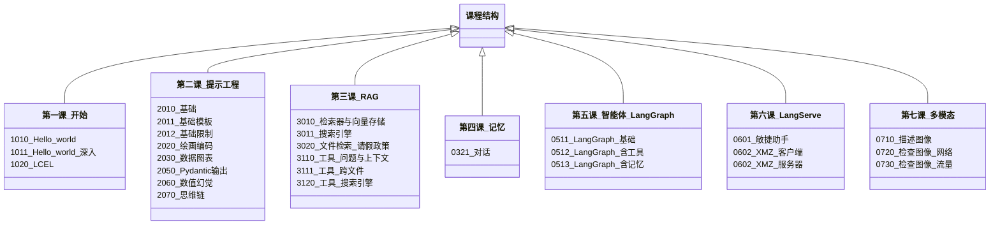
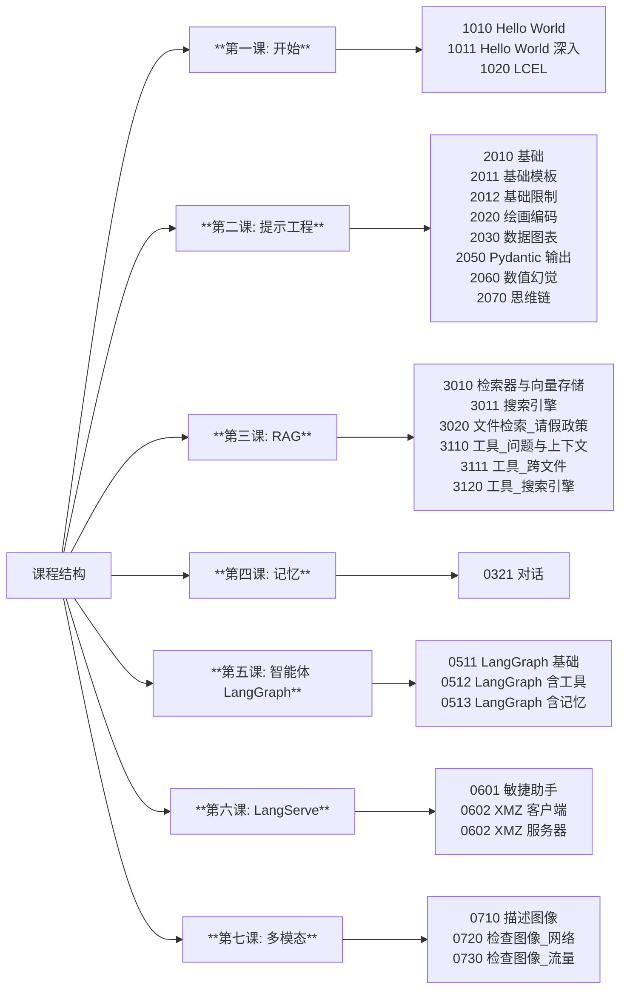

# 课程结构

## 时间安排

```mermaid
gantt
    title 大语言模型课程结构时间线
    dateFormat HH:mm
    axisFormat %H:%M

    section 上午
    📖课程目标及大语言模型概念     :  09:00, 0.5h
    📖Hello World               :  09:30, 0.5h
    📖提示词工程                 :10:00, 0.5h
    📖RAG 检索增强生成           :      10:30, 0.5h
    🎊彩蛋：人工智能辅助编程           :      11:00, 0.5h
    ⌚个人练习           :      11:30, 0.5h
    🍕午餐               : active,     12:00, 1h

    section 下午
    📖Langgraph 智能体          :      13:00, 1h
    📖多模态                     :      14:00, 0.5h
    ⌚个人练习时间               :      14:30, 0.5h
    🏆分组竞赛                   :active,      15:00, 2h
    🚩课程结束                   : 17:00, 0h
    .                           : 17:55, 0h
```

## 课程内容

```mermaid
classDiagram
  课程结构 <|-- 第一课_开始
  课程结构 <|-- 第二课_提示工程
  课程结构 <|-- 第三课_RAG
  课程结构 <|-- 第四课_记忆
  课程结构 <|-- 第五课_智能体_LangGraph
  课程结构 <|-- 第六课_LangServe
  课程结构 <|-- 第七课_多模态

  第一课_开始 : 1010_Hello_world
  第一课_开始 : 1011_Hello_world_深入
  第一课_开始 : 1020_LCEL

  第二课_提示工程 : 2010_基础
  第二课_提示工程 : 2011_基础模板
  第二课_提示工程 : 2012_基础限制
  第二课_提示工程 : 2020_绘画编码
  第二课_提示工程 : 2030_数据图表
  第二课_提示工程 : 2050_Pydantic输出
  第二课_提示工程 : 2060_数值幻觉
  第二课_提示工程 : 2070_思维链

  第三课_RAG : 3010_检索器与向量存储
  第三课_RAG : 3011_搜索引擎
  第三课_RAG : 3020_文件检索_请假政策
  第三课_RAG : 3110_工具_问题与上下文
  第三课_RAG : 3111_工具_跨文件
  第三课_RAG : 3120_工具_搜索引擎

  第四课_记忆 : 0321_对话

  第五课_智能体_LangGraph : 0511_LangGraph_基础
  第五课_智能体_LangGraph : 0512_LangGraph_含工具
  第五课_智能体_LangGraph : 0513_LangGraph_含记忆

  第六课_LangServe : 0601_敏捷助手
  第六课_LangServe : 0602_XMZ_客户端
  第六课_LangServe : 0602_XMZ_服务器

  第七课_多模态 : 0710_描述图像
  第七课_多模态 : 0720_检查图像_网络
  第七课_多模态 : 0730_检查图像_流量

```

## 详细内容

```mermaid
flowchart LR
  A[课程结构] --> B[**第一课: 开始**]
  A --> C[**第二课: 提示工程**]
  A --> D[**第三课: RAG**]
  A --> E[**第四课: 记忆**]
  A --> F[**第五课: 智能体 LangGraph**]
  A --> G[**第六课: LangServe**]
  A --> H[**第七课: 多模态**]

  B --> B1["1010 Hello World<br>1011 Hello World 深入<br>1020 LCEL"]
  C --> C1["2010 基础<br>2011 基础模板<br>2012 基础限制<br>2020 绘画编码<br>2030 数据图表<br>2050 Pydantic 输出<br>2060 数值幻觉<br>2070 思维链"]
  D --> D1["3010 检索器与向量存储<br>3011 搜索引擎<br>3020 文件检索_请假政策<br>3110 工具_问题与上下文<br>3111 工具_跨文件<br>3120 工具_搜索引擎"]
  E --> E1["0321 对话"]
  F --> F1["0511 LangGraph 基础<br>0512 LangGraph 含工具<br>0513 LangGraph 含记忆"]
  G --> G1["0601 敏捷助手<br>0602 XMZ 客户端<br>0602 XMZ 服务器"]
  H --> H1["0710 描述图像<br>0720 检查图像_网络<br>0730 检查图像_流量"]


```

```mermaid


```
