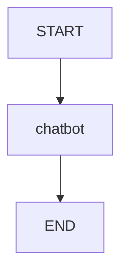
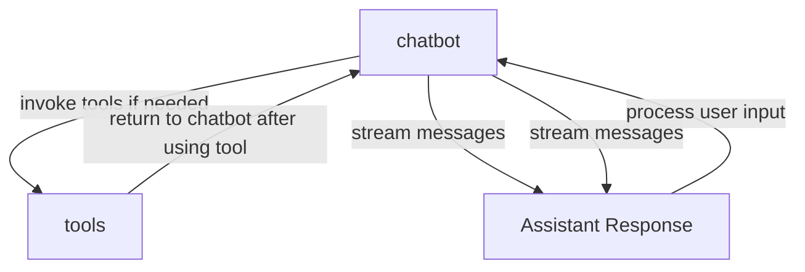
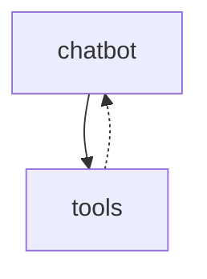

# 此文档用于展示 LangGraph 的结构

## 用法

- 拷贝一段与 LangGraph 相关的代码。
- 在 Chatgpt 或者其他 LLM 应用中要求其提供对应的 mermaid td digram 脚本。
- 提示词如下（两条线中间的内容，不包括线条：

---

第一步：提取代码中包含 add_node() 和 add_edge() 和 add_conditional_edges() 的代码行，并列出上述代码行
第二步：单独列出包含 add_edge 和 add_conditional_edges 的代码行
第三步：创建一个 mermaid td digram 脚本。请严格按照第三步中的代码行的数量绘制：为 add_edge 绘制实线，为 add_conditional_edges 绘制虚线。
第四步：按 markdown 格式，输出如下的格式的脚本（不要额外的解释，只要脚本）。

完整代码如下：

---

- 拷贝完成上面的提示词后，把整个代码拷贝到后面。
- 发送给 LLM 应用。
- 把返回的脚本拷贝到下面查看效果。
  - 只有安装了 vscode 插件如 Mermaid Preview 才能看到图形

例如：



```mermaid
   (脚本拷贝到这里)
```

```mermaid
   (脚本拷贝到这里)
```

```mermaid
   (脚本拷贝到这里)
```

```mermaid
   (脚本拷贝到这里)
```

```mermaid
   (脚本拷贝到这里)
```

```mermaid
   (脚本拷贝到这里)
```

```mermaid
   (脚本拷贝到这里)
```




